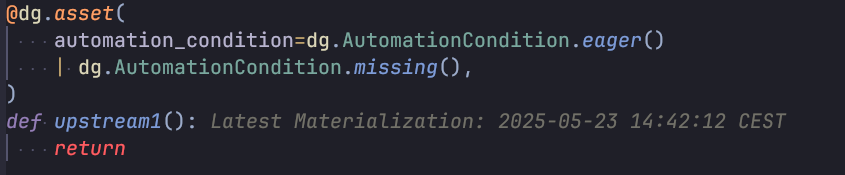

# Dagster.nvim

## Config

### Requirements:

* plenary
* telescope
* treesitter

### Installation

#### Lazy:
```lua
    {
        "matthias-Q/dagster.nvim",
        config = function()
            require("dagster-nvim").setup({
                endpoint = "http://localhost:3000/graphql",
                repositoryName = "__repository__",
                repositoryLocationName = "dgdemo",
                auto_start = false
            })
        end
    }
```

## Features

* Telescope Picker with all assets  and their last materialization
* can poll automation sensor for automaterialization events
* virtual text annotations for assets showing their last materialization



## TODO:

[ ] Fix Treesitter Queries
[ ] Include Treesitter queries for group name
[ ] Cleanup code base

